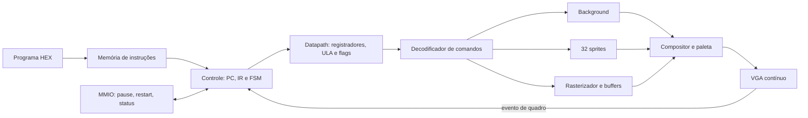

<<<<<<< HEAD
# Coprocessador gráfico programável — PBL2SD

Projeto em Verilog para a **DE1-SoC, FPGA Cyclone V 5CSEMA5F31C6**, desenvolvido por **Lucca Coutinho, Mailson Alves e Ramon Santos**, do curso de Engenharia de Computação da Universidade Estadual de Feira de Santana (UEFS). A revisão física da placa usada na demonstração histórica não foi confirmada.

O Problema 2 evolui a branch selecionada `pbl2/etapa3-conclusao-pbl1`: preserva os motores do PBL1 e acrescenta CPU de busca ativa, ISA de 32 bits, registradores, ULA, datapath, fluxo, sincronização de quadro, Assembly e interface RTL MMIO. O programa interno determina as operações; os dois programas de demonstração usam o mesmo RTL. A arquitetura executa programas gráficos genéricos. Driver Linux e aplicação de jogo pertencem a etapas posteriores.

**Integração física HPS-FPGA, compilação final no Quartus, timing e demonstração desta versão na placa permanecem pendentes.** Simulação e pré-síntese não substituem essas verificações.

## Requisitos e arquitetura implementada

| Requisito | Implementação |
|---|---|
| ISA de 32 bits e programa interno | `instruction_memory`, arquivos HEX e montador `tools/assemble.py`. |
| Busca ativa, PC, IR e controle | FSM multiciclo de `active_fetch_controller`; espera aceitação e conclusão dos comandos. |
| Registradores, ULA e datapath | `gpu_register_file`, `gpu_alu`, `gpu_datapath`, `gpu_instruction_decoder`; resultados aritméticos alimentam gráficos. |
| Status e protocolo | Flags Z/N/C/V, erro persistente, `cmd_valid/cmd_ready`, `busy`, pulso `done`, `HALT` e `WAIT_FRAME`. |
| Background e sprites | Tilemap 40×30; tiles 8×8; 32 sprites 16×16 com posição, imagem, enable, flips, prioridade e banco de paleta. |
| Polígonos e quadros | Triângulos preenchidos, retângulos por dois triângulos, limpeza e apresentação sincronizada de buffer duplo. |
| Vídeo contínuo | Compositor, paleta de 256 cores e VGA 640×480; cena lógica 320×240 ampliada em 2×2. |
| MMIO básico | `gpu_mmio` ligado a `gpu_core`; controle/status testáveis em RTL. Ponte física HPS ainda precisa ser integrada. |
| Hardware e reprodução | Projeto Quartus e scripts; recursos e frequência finais dependem do fitter/TimeQuest. |



`gpu_de1_soc_top` conserva os pinos da placa e instancia `gpu_core`, que integra CPU e gráficos. O wrapper desabilita o barramento MMIO externo até existir um sistema HPS/Platform Designer. A [arquitetura](docs/pbl2-architecture.md) detalha FSM, handshake, datapath e gargalos; o [guia MMIO](docs/hps-mmio.md) especifica os registradores e a integração restante.

A composição preserva **sprite → polígono → background**. Entre sprites opacos vence a maior prioridade (0–3); no empate, o menor ID. Índice zero é transparente em sprites/polígonos. Com banco de paleta habilitado, o nibble inferior zero é transparente e o índice visível é `{banco[3:0], pixel[3:0]}`. O rasterizador aceita ambas as ordens dos vértices, usa arestas inclusivas, rejeita área zero e recorta escritas em 320×240.

**O buffer duplo cobre apenas polígonos.** Tilemap, sprites e paleta são atualizados diretamente. VGA continua durante inicialização, execução, pausa, espera e HALT. Com clock de pixel de 25 MHz, 800 períodos/linha e 525 linhas/quadro, a frequência nominal é aproximadamente **59,52 Hz**.

Reset reinicializa controles, CPU, sprites e buffers, mas preserva escritas na CLUT/tilemap. Restart MMIO reinicia somente a CPU e aguarda operações já aceitas. A [estratégia de inicialização](docs/pbl2-architecture.md#inicialização-de-memórias-e-reset) detalha cada memória.

## ISA de 32 bits

`[31:28]` contém o opcode; reservados são zero. Existem 16 registradores de 32 bits (`r0`–`r15`); `r0` sempre lê zero. A [especificação completa](docs/pbl2-isa.md) detalha validação, máscaras, flags e aliases. As tabelas abaixo listam todas as instruções nativas e pseudoinstruções.

### Comandos gráficos imediatos preservados

| Opcode / palavra | Assembly | Campos de dados e reservados |
|---|---|---|
| `0F000000` | `CLEAR` | Limpa com zero o buffer de desenho de polígonos. |
| `1` | `PALETTE addr, rgb565` | addr `[23:16]`, RGB565 `[15:0]`; `[27:24]=0`. |
| `3` | `TILE x, y, tile` | x `[21:16]` (0–39), y `[12:8]` (0–29), tile `[7:0]`; `[27:22]` e `[15:13]=0`. |
| `5` | `SCROLL x, y` | x `[16:8]`, y `[7:0]`; `[27:17]=0`. |
| `6` | `BIRD_Y y` | y `[7:0]`; `[27:8]=0`. Compatibilidade: sprite 0, X=152, imagem 1, enable=1, sem flips, estilo padrão. |
| `7`, `8` | `TRI1 x, y`; `TRI2 x, y` | x `[16:8]`, y `[7:0]`; `[27:17]=0`. Guardam vértices. |
| `9` | `TRI3 x, y, color` | cor `[27:20]`, x `[16:8]`, y `[7:0]`; `[19:17]=0`. Inicia o triângulo. |
| `A` | `SPR_POS id, x, y` | ID `[27:23]`, x `[22:14]`, y `[13:6]`; `[5:0]=0`. |
| `B` | `SPR_ATTR id, tile, en, h, v` | ID `[27:23]`, tile `[22:15]`, enable `[14]`, flipH `[13]`, flipV `[12]`; `[11:0]=0`. |
| `C` | `SPR_STYLE id, priority, pen, bank` | ID `[27:23]`, prioridade `[22:21]`, paleta enable `[20]`, banco `[19:16]`; `[15:0]=0`. |
| `D0000000/1` | `BUFFER_CONFIG 0/1` | Desabilita/habilita buffer duplo de polígonos. |
| `D1000000` | `PRESENT` | Aguarda troca de buffers no evento de quadro; exige buffer duplo. |

### ULA, gráficos por registrador e fluxo

| Família / subop | Assembly | Formato abaixo do opcode |
|---|---|---|
| `2 / 0` | `MOVI rd, u16` | subop `[27:24]`, rd `[23:20]`, `[19:16]=0`, imediato `[15:0]`. |
| `2 / 1` | `MOV rd, ra` | subop, rd `[23:20]`, ra `[19:16]`, `[15:0]=0`. |
| `2 / 2…8` | `ADD`, `SUB`, `AND`, `OR`, `XOR`, `SHL`, `SHR rd, ra, rb` | subop, rd `[23:20]`, ra `[19:16]`, rb `[15:12]`, `[11:0]=0`; subops na ordem listada. |
| `2 / 9` | `CMP ra, rb` | subop, `[23:20]=0`, ra `[19:16]`, rb `[15:12]`, `[11:0]=0`. |
| `2 / A` | `ADDI rd, ra, s16` | subop, rd `[23:20]`, ra `[19:16]`, imediato `[15:0]`. |
| `4 / 0` | `EMIT ra` | Formato R gráfico, rb=rc=ID=0; envia ra completo ao decoder gráfico. |
| `4 / 1` | `SCROLLR ra, rb` | R gráfico: X em ra, Y em rb; rc=ID=0. |
| `4 / 2` | `SPR_POSR id, ra, rb` | R gráfico: ID imediato, X em ra, Y em rb; rc=0. |
| `4 / 3,4,5` | `TRI1R ra, rb`; `TRI2R ra, rb`; `TRI3R ra, rb, rc` | R gráfico: X em ra, Y em rb, cor em rc na terceira; ID=0 e rc=0 nas duas primeiras. |
| `4 / 6` | `TILER ra, rb, rc` | R gráfico: X, Y, tile em ra, rb, rc; ID=0. |
| `4 / 7` | `PALETTER ra, rb` | R gráfico: endereço e RGB565 em ra, rb; rc=ID=0. |
| `4 / 8` | `SPR_ATTRR id, ra, rb` | R gráfico: tile em ra; rb `[2:0]={enable,flipH,flipV}`; rc=0. |
| `4 / 9` | `SPR_STYLER id, ra, rb` | R gráfico: prioridade ra `[1:0]`; rb `[4:0]={paleta enable,banco}`; rc=0. |
| `E0000000` | `NOP` | Sem efeito gráfico ou aritmético. |
| `E1000000` | `WAIT_FRAME` | Aguarda evento de quadro posterior à entrada na espera. |
| `E / 2,3,4` | `JMP alvo`; `JZ alvo`; `JNZ alvo` | subop `[27:24]`, `[23:8]=0`, endereço absoluto de palavra `[7:0]`. |
| `E / 5` | `STATUS rd` | subop `[27:24]`, rd `[23:20]`, `[19:0]=0`; lê flags e erro. |
| `F0000000` | `HALT` | Palavra exata; para CPU, mantendo imagem/VGA. |
| Pseudo | `RECT x0, y0, x1, y1, cor` | Seis comandos, desenhando dois triângulos. |
| Pseudo | `RECTR rx0, ry0, rx1, ry1, rcor` | Seis comandos por registrador, sem modificar registradores. |

O formato R gráfico é `4 | subop[3:0] | ra[3:0] | rb[3:0] | rc[3:0] | id[4:0] | 0[6:0]`. Valores dos registradores são mascarados: X=9 bits, Y=8, tile/cor=8, endereço CLUT=8, RGB565=16, prioridade=2 e banco=4. TILER usa X=6/Y=5 bits e rejeita coordenadas fora de 40×30.

A ULA atualiza `{V,C,N,Z}`: Z indica zero, N é o bit 31, C é carry em soma/ausência de empréstimo em subtração, V é overflow com sinal. CMP apenas atualiza flags. SHR é lógico; shifts usam rb `[4:0]`. MOV/MOVI/lógicas/shifts zeram C e V. STATUS retorna flags `[3:0]` e erro persistente `[4]`, preservando flags. Instruções inválidas registram erro e avançam sem efeitos gráficos/aritméticos.

## Assembly e programas diferentes

O montador requer **Python 3.10+**, sem pacotes externos. Aceita inteiros decimais/hexadecimais, labels de endereço de palavra e comentários `;`, `#` ou `//`. MOVI recebe 0–65535; ADDI, −32768–32767. `.WORD` permite palavras explícitas. Nomes legados, como SET_SCROLL, continuam como aliases.

```bash
cd /workspace/PBL2SD
python3 tools/assemble.py programs/background_sprites.asm
python3 tools/assemble.py programs/polygons_motion.asm
# Seu programa, preenchido com HALT até 256 palavras:
python3 tools/assemble.py programs/meu_programa.asm --words 256
```

Cada HEX contém uma palavra de 32 bits por linha. Execute simulações a partir da raiz, pois caminhos das memórias são relativos. `tiles.hex`, `tilemap_data.hex` e `palette.hex` continuam fornecendo recursos gráficos. O fluxo carrega HEX com `$readmemh`; MIF precisa ser convertido para esse formato antes de uso.

| Programa | Demonstração | Resultado após quatro iterações |
|---|---|---|
| [background_sprites.asm](programs/background_sprites.asm) / [HEX](programs/background_sprites.hex) | Tilemap, scroll calculado pela ULA, sprites 1/2/3/31, quatro combinações de flips, prioridade e banco de paleta. | Scroll X=32; sprites 1/2 em X=104/110; 3/31 fixos. Cada iteração aguarda WAIT_FRAME. |
| [polygons_motion.asm](programs/polygons_motion.asm) / [HEX](programs/polygons_motion.hex) | Triângulos vermelho/ciano, retângulo amarelo, sprites e deslocamento calculado em registradores; buffer duplo. | Triângulo vermelho em (56,48), (120,48), (88,100); sprite 1 em (232,96). Cada iteração usa WAIT_FRAME e PRESENT. |

Ambos terminam em HALT e mantêm a última imagem. As quatro iterações demonstram sincronização por um intervalo curto; altere o Assembly para alongar/repetir o movimento. RECT exige área positiva (`x0<x1`, `y0<y1`) com cantos inclusivos. RECTR com largura/altura zero produz primitivas degeneradas sem pixels.

O top usa **`USE_ACTIVE_FETCH=1`, `PROGRAM_WORDS=256` e `PROGRAM_FILE="programs/background_sprites.hex"`** por padrão. Ambos os HEX têm 256 palavras: basta trocar PROGRAM_FILE na configuração da instância/compilação. A seleção ocorre antes da síntese; não há seleção por chaves ou carregamento de programa via MMIO.

KEY[0] permanece reset; os demais botões não controlam a execução no modo principal. O modo histórico pode ser compilado com USE_ACTIVE_FETCH=0. LEDR[3] indica HALT, [4] erro persistente, [5] buffers inicializados, [6] buffer frontal, [7] buffer duplo e [8] sprite busy.

## Testes reproduzíveis

Ferramentas: Verilator 5, Icarus Verilog, Python 3.10+, compilador C++ e Make. Yosys é necessário para pré-síntese. No ambiente preparado:

```bash
source /workspace/.pbl-tools/activate.sh
cd /workspace/PBL2SD
bash scripts/test_pbl2.sh
bash scripts/synth_precheck.sh
```

`test_pbl2.sh` executa testes Python, compara HEX gerados/publicados, testes de CPU/MMIO/programas e a regressão PBL1 de 17 testbenches. Erro ou timeout interrompe a execução; logs ficam em `.build/pbl2/` e nos diretórios das regressões. RTL dispensa placa e SDL2.

| Teste | Cobertura principal |
|---|---|
| `test_assembler.py` | Codificação, labels, pseudoinstruções, erros de operandos/limites. |
| `tb_gpu_cpu_units` | Banco, ULA, flags, decoder e conversão gráfica. |
| `tb_gpu_cpu_control` | Busca, PC/IR, branches, esperas, HALT, erros, pausa e reinício. |
| `tb_gpu_mmio` | Mapa, byteenables, pulsos, RO, offsets inválidos, contador e reset. |
| `tb_pbl2_programs` | Mesma integração com dois programas, comandos/pixels, quadros e VGA após HALT. |
| `tb_pbl2_control` | Ligação MMIO–CPU, pausa/restart/erro/status e preservação gráfica/VGA. |
| `test_step3.sh` | 32 sprites/flips/prioridades/transparência, paleta, background, memórias, rasterização, buffers e inicialização em quatro estados. |

```bash
python3 -m unittest discover -s tests -p 'test_assembler.py' -v
bash scripts/test_step3.sh --four-state-only
bash scripts/synth_precheck.sh --structure-only
bash scripts/synth_precheck.sh --board
```

**Resultados observados:** a suíte completa terminou com código 0: **12 testes Python e 22 testbenches RTL distintos passaram** (cinco novos e 17 regressões). As duas demos foram verificadas com referências independentes de pixels e sincronismo, incluindo um quadro completo após HALT. O precheck Cyclone V passou nos modos principal/histórico, com 220/219 M10K no modelo Yosys; esses números não são recursos finais do fitter. Consulte o [relatório de validação](docs/pbl2-validation.md) para evidências, ferramentas e limites. Relatórios/bitstreams históricos não validam esta versão.

## Compilar no Quartus e validar na placa

Use Quartus Prime com suporte Cyclone V e quartus_sh no PATH. O projeto inclui dispositivo 5CSEMA5F31C6, pinos DE1-SoC e gpu.sdc com clocks de 20/40 ns. Confirme revisão da placa e restrições externas VGA antes da validação física.

```bash
# Principal: background/sprites, 256 palavras:
bash scripts/synth_quartus.sh
# Outro programa, sem alterar RTL:
bash scripts/synth_quartus.sh --program programs/polygons_motion.hex
# Programa próprio:
bash scripts/synth_quartus.sh --program programs/meu_programa.hex --words 256
# Fluxos históricos:
bash scripts/synth_quartus.sh --board
bash scripts/synth_quartus.sh --active  # fetch_demo.hex, 9 palavras
bash scripts/synth_quartus.sh --pbl1   # pbl1_validation.hex, 17 palavras
# Cópia revisável sem Quartus:
bash scripts/synth_quartus.sh --program programs/polygons_motion.hex --prepare-only
```

As seleções --board/--active/--pbl1/--program são exclusivas. --words define 1–256 palavras; o script exige exatamente essa quantidade de palavras HEX com oito dígitos. Imagens curtas devem ser montadas com o tamanho correspondente ou preenchidas com HALT; os presets históricos já selecionam 9/17 palavras. O script compila uma cópia isolada em `.build/quartus/run.*/`, aplicando parâmetros apenas nessa cópia. Trocar o programa exige nova síntese.

O precheck Yosys verifica estrutura e inferência preliminar de RAM; não gera .sof ou Fmax. Após Quartus, revise ALMs/RAM, clocks, setup/hold, slack, caminhos não restringidos e timing externo do DAC/VGA. Programe o .sof novo pelo Programmer, execute ambos os programas e confira o [roteiro físico](docs/validacao-fisica-pbl1.md). Recursos finais, timing, desempenho em placa e acesso HPS ainda não têm comprovação física.

## Histórico e referências

Os guias das [etapas 1](docs/pbl2-etapa1.md), [2](docs/pbl2-etapa2.md) e [conclusão do PBL1](docs/pbl1-etapa3.md) registram checkpoints anteriores. Limitações/padrões nesses documentos descrevem aquelas versões; a ISA/arquitetura atuais são as deste README e dos guias PBL2. A raster_alu continua especializada; a ULA geral é gpu_alu.

A foto abaixo pertence à demonstração original. Preserva o histórico dos autores e não comprova validação física das modificações atuais.


- Enunciados dos Problemas 1 e 2, Sistemas Digitais, UEFS, 2026.2.
- Terasic, *DE1-SoC User Manual* e esquema da revisão utilizada.
- Intel, *Cyclone V Device Handbook*, Quartus/TimeQuest e Platform Designer.
- Pineda, Juan. *A Parallel Approach to Polygon Rasterization*. SIGGRAPH, 1988.
=======
# Coprocessador gráfico 2D — PBL2SD

Projeto em Verilog para a DE1-SoC, desenvolvido por **Lucca Coutinho, Mailson Alves e Ramon Santos**, do curso de Engenharia de Computação da Universidade Estadual de Feira de Santana (UEFS).

O desenvolvimento é organizado em branches encadeadas. A etapa atual, `pbl2/etapa3-conclusao-pbl1`, trata das pendências gráficas do Problema 1 sobre a busca ativa e os sprites genéricos das etapas anteriores. A `main` permanece no ponto já publicado, até autorização para integrar as alterações.

O RTL possui background por tiles, 32 sprites, rasterização de polígonos, composição e paleta de cores. Os testes de simulação e os procedimentos de síntese são reproduzíveis. **A compilação final no Quartus, a análise de timing e a demonstração desta versão na placa continuam necessárias.** Consulte o [guia da etapa 3](docs/pbl1-etapa3.md) e o [roteiro de validação física](docs/validacao-fisica-pbl1.md).

## Arquitetura

```text
Botões OU memória de instruções → controle de comandos → motores gráficos
                                                            ↓
VGA: coordenadas e evento de quadro → composição → paleta → RGB e sincronismo
```

| Módulo | Responsabilidade |
|---|---|
| `gpu_de1_soc_top` | Integração, seleção da origem de comandos, reset, clocks, alinhamento dos pixels e pinos da placa. |
| `board_input_controller` | Demonstração por botões, com espera pela aceitação dos comandos. |
| `instruction_memory` / `active_fetch_controller` | Programa interno, PC, IR, execução sequencial, espera por conclusão e `HALT`. |
| `cmd_decoder` | Validação dos campos e envio de operações aos motores; comando inválido gera erro sem alterar as unidades gráficas. |
| `vga_sync` | Contadores, sincronismo, área visível, coordenadas lógicas e intervalo vertical. |
| `bg_engine` / `tilemap_ram` | Mapa 40×30 de tiles 8×8, atualização de células e rolagem nos dois eixos. |
| `pattern_vram` | Padrões indexados de 256 tiles, carregados de `tiles.hex`. |
| `sprite_engine` | 32 sprites 16×16, posição, imagem, habilitação, espelhamentos, prioridade, transparência e banco de paleta. |
| `polygon_rasterizer` / `raster_alu` | Controle de varredura e datapath inteiro de funções de aresta para preencher triângulos. Retângulos usam dois triângulos. |
| `polygon_buffer` | Inicialização sequencial e dois buffers para a camada de polígonos, com troca no intervalo vertical. |
| `compositor` / `color_palette` | Prioridade sprite → polígono → background e tradução do índice para RGB de 24 bits. |

A entrada é 50 MHz e o clock VGA é 25 MHz. Com 800 períodos por linha e 525 linhas por quadro, a frequência real é aproximadamente **59,52 Hz**. A área física é 640×480; a cena lógica é 320×240, ampliada em 2×2.

A `raster_alu` é uma **ULA gráfica especializada**, usada pelo rasterizador. Ela não substitui o banco de registradores, a ULA geral e o datapath de execução de instruções que ainda serão desenvolvidos para o Problema 2. O registrador de status, o controle programável de quadros e a ISA/Assembly completos também permanecem para os próximos checkpoints.

## Renderização e memória

- O background usa `tilemap_data.hex`; padrões e paleta usam `tiles.hex` e `palette.hex`. As escritas no mapa rejeitam coordenadas fora de 40×30 e a rolagem trata os campos completos sem truncar a soma antes da repetição.
- Cada sprite tem um cache de 256 pixels. Uma ROM de padrões abastece os caches por 256 leituras sequenciais, com latência adicional do pipeline. `busy` permanece ativo até o último pixel ser gravado; um cache inválido não é exibido. Isso evita replicar toda a ROM para cada sprite.
- Entre sprites opacos, vence o maior valor de prioridade, de 0 a 3; no empate, vence o menor ID. Pixels transparentes permitem ver os sprites atrás deles.
- Sem banco de paleta, o índice completo de oito bits é usado e zero é transparente. Com banco habilitado, o índice é `{banco[3:0], pixel[3:0]}` e o nibble inferior zero é transparente, independentemente do banco.
- O rasterizador captura os vértices e a cor ao iniciar. Arestas são inclusivas, as duas ordens de vértices são aceitas e triângulos de área zero não escrevem pixels. O recorte de escrita é 320×240.
- Os dois buffers de polígonos são limpos no reset. Com buffer duplo habilitado, os desenhos vão para o buffer de trás; uma solicitação de apresentação aguarda o evento de quadro e libera o próximo comando após a troca.

**O buffer duplo cobre somente os polígonos.** Escritas em sprites, tilemap e CLUT continuam diretas e não são atualizações atômicas do quadro inteiro. O VGA segue funcionando durante a inicialização, desenhos, carregamento de sprites e espera pela apresentação.

## Comandos de 32 bits

O opcode ocupa `[31:28]`. Campos reservados devem ser zero. Os comandos de sprites usam ID em `[27:23]`, de 0 a 31.

| Opcode / palavra | Comando | Campos e efeito |
|---|---|---|
| `0F000000` | `CLEAR_SCREEN` | Limpa o buffer de desenho de polígonos com índice zero. |
| `0x1` | `SET_PALETTE` | `[23:16]` endereço; `[15:0]` cor RGB565. |
| `0x3` | `WRITE_TILEMAP` | `[21:16]` X; `[12:8]` Y; `[7:0]` tile. |
| `0x5` | `SET_SCROLL` | `[16:8]` X; `[7:0]` Y. |
| `0x6` | `UPDATE_BIRD_Y` | `[7:0]` Y. Compatibilidade: sprite 0, X=152, tile=1, habilitado, sem flips e estilo padrão. |
| `0x7` | `DRAW_TRI_V1` | `[16:8]` X0; `[7:0]` Y0. |
| `0x8` | `DRAW_TRI_V2` | `[16:8]` X1; `[7:0]` Y1. |
| `0x9` | `DRAW_TRI_V3` | `[27:20]` cor; `[16:8]` X2; `[7:0]` Y2. Inicia o desenho. |
| `0xA` | `SET_SPRITE_POS` | `[27:23]` ID; `[22:14]` X; `[13:6]` Y. Preserva os atributos. |
| `0xB` | `SET_SPRITE_ATTR` | `[27:23]` ID; `[22:15]` tile inicial; `[14]` enable; `[13]` flip horizontal; `[12]` flip vertical. Preserva a posição e o estilo. |
| `0xC` | `SET_SPRITE_STYLE` | `[27:23]` ID; `[22:21]` prioridade; `[20]` habilitação de banco; `[19:16]` banco de paleta. |
| `D0000000` / `D0000001` | `BUFFER_CONFIG` | Desabilita / habilita buffer duplo de polígonos. |
| `D1000000` | `BUFFER_SWAP` | Solicita apresentação no intervalo vertical; exige buffer duplo habilitado. |
| `F0000000` | `HALT` | Encerra o programa da busca ativa, mantendo o VGA. |

`HALT` é tratado pelo controlador de busca, não pelo decodificador gráfico. Os formatos acima descrevem os comandos atuais; a ISA programável completa do Problema 2 será consolidada nas próximas etapas.

## Testes reproduzíveis

Use Verilator 5, compilador C++, Make e Icarus Verilog no `PATH`. Os testes RTL dispensam placa e SDL2. Neste ambiente em nuvem:

```bash
cd /workspace/PBL1SD
source /workspace/.pbl-tools/activate.sh
bash scripts/test_step3.sh
```

O script executa os testes da etapa 3, a regressão das etapas anteriores e a verificação de inicialização com Icarus Verilog. Para executar apenas a verificação em quatro estados (`0`, `1`, `X`, `Z`):

```bash
bash scripts/test_step3.sh --four-state-only
```

Os testbenches conferem sprites, prioridades, transparência, paleta, background e limites, memórias e compositor, rasterização, reset, comandos inválidos, espera por aceitação, buffers e VGA. Erro ou timeout deve interromper a execução com código diferente de zero; cada teste concluído imprime `PASS`. Consulte o [guia da etapa 3](docs/pbl1-etapa3.md) para comandos, cobertura e resultados da execução desta branch.

## Executar os programas internos

O top-level mantém `USE_ACTIVE_FETCH=0` como padrão: `KEY[0]` é reset, `KEY[1]` aplica impulso ao pássaro, `KEY[2]` solicita triângulo e `KEY[3]` solicita retângulo.

Com busca ativa, os parâmetros padrão são `PROGRAM_WORDS=9` e `PROGRAM_FILE="programs/fetch_demo.hex"`. Para o programa de validação gráfica de 17 palavras, configure:

```verilog
gpu_de1_soc_top #(
    .USE_ACTIVE_FETCH(1),
    .PROGRAM_WORDS(17),
    .PROGRAM_FILE("programs/pbl1_validation.hex")
) instancia (...);
```

A seleção é feita na compilação, não por chave física. O programa é finito: configura a cena e termina em `HALT`; não implementa ainda um jogo completo nem um laço Assembly. `LEDR[3]` indica parada do programa, `LEDR[4]` registra erro de comando, `LEDR[5]` indica buffers inicializados e `LEDR[7]` indica buffer duplo habilitado.

Os guias históricos das [etapas 1](docs/pbl2-etapa1.md) e [2](docs/pbl2-etapa2.md) descrevem aqueles checkpoints. As limitações citadas neles devem ser interpretadas conforme a versão de cada etapa.

## Síntese e teste na DE1-SoC

O precheck usa Yosys para verificar estrutura e inferência preliminar de RAM. Não gera bitstream nem comprova frequência ou recursos definitivos:

```bash
bash scripts/synth_precheck.sh
bash scripts/synth_precheck.sh --active
# Apenas hierarquia, drivers e memórias:
bash scripts/synth_precheck.sh --structure-only
```

Com Quartus Prime e suporte Cyclone V instalados:

```bash
bash scripts/synth_quartus.sh
# Busca ativa com fetch_demo.hex, o programa padrão de nove palavras:
bash scripts/synth_quartus.sh --active
# Novo programa de validacao desta etapa (17 palavras):
bash scripts/synth_quartus.sh --pbl1
# Somente preparar uma copia revisavel, sem exigir Quartus:
bash scripts/synth_quartus.sh --pbl1 --prepare-only
```

A compilação usa uma cópia em `.build/quartus/`, preservando saídas históricas. `--pbl1` aplica os três parâmetros do programa novo apenas nessa cópia. Verifique recursos, inferência de RAM, clocks, setup/hold e caminhos não restringidos antes de programar a placa.

O projeto inclui `gpu.sdc` com clocks de 20/40 ns. As restrições externas VGA ainda precisam ser confirmadas com a placa e o DAC, conforme o [roteiro de validação física](docs/validacao-fisica-pbl1.md). Os arquivos `.sof` e relatórios antigos do repositório **não validam o RTL desta branch**.

## Registro histórico

A foto abaixo pertence à demonstração da versão original do projeto. Ela preserva o histórico do trabalho dos autores e não comprova a validação física das modificações atuais.


## Referências

- Terasic, *DE1-SoC User Manual* e esquema da revisão utilizada.
- Intel, *Cyclone V Device Handbook* e documentação de Quartus/TimeQuest.
- Pineda, Juan. *A Parallel Approach to Polygon Rasterization*. SIGGRAPH, 1988.
- Documentos dos Problemas 1 e 2 fornecidos no curso.
>>>>>>> 1ee5570 (busca ativa com erros de exibição)
