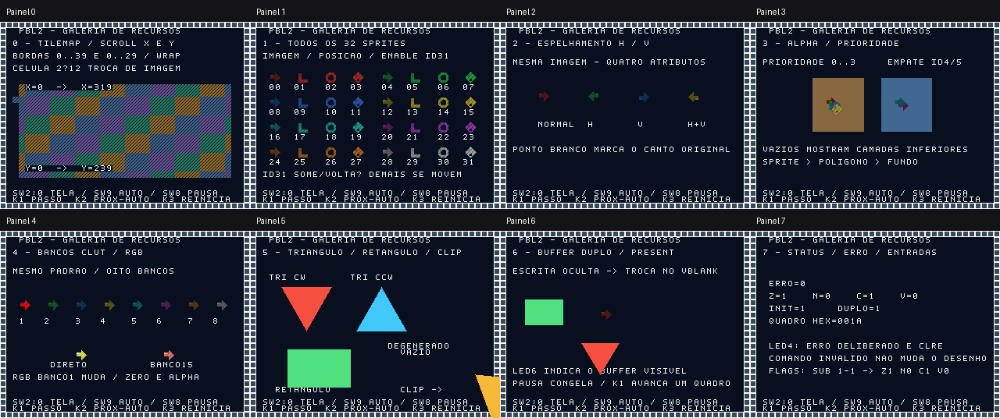

# Galeria de recursos na DE1-SoC

Este guia usa a branch `pbl2/etapa4-arquitetura-demonstracao`. A galeria de oito telas é o modo padrão; não é necessário jogar ou editar parâmetros. O programa executa pela arquitetura programável e demonstra recursos separadamente.

## Compilar e gravar

No Linux com Quartus e suporte Cyclone V instalados:

1. Abra **`gpu.qpf` desta branch**. Mantenha as pastas `assets/` e `programs/` junto ao projeto.
2. Escolha **Processing → Start Compilation** e aguarde o término sem erros.
3. Abra **Tools → Programmer**.
4. Em **Hardware Setup**, selecione **USB-Blaster** e mantenha **JTAG**.
5. Adicione **`output_files/gpu.sof` recém-gerado**, marque **Program/Configure** e clique em **Start**.
6. Ao chegar a 100%, com placa ligada e monitor conectado ao VGA, pressione e solte **KEY0**.

O circuito começa a executar assim que é gravado. KEY0 reinicia o programa. Não é necessário abrir um arquivo no Linux da placa. A gravação `.sof` é volátil: normalmente precisa ser repetida após desligar a placa.

**Compilar no computador não atualiza a placa.** Se ela mostra a demonstração antiga por botões, confira o `.sof` gravado. SSH apenas copia o arquivo; esta branch não inclui carregador pelo HPS.

Pelo terminal, a alternativa é:

```bash
bash scripts/synth_quartus.sh
```

O script informa uma pasta como `.build/quartus/run.XXXXXX`. Nesse caso, selecione **`output_files/gpu.sof` dentro dessa cópia**, em vez do arquivo na pasta original.

Se USB-Blaster não aparece, a gravação por esse método está impedida. Com placa ligada e cabo na porta USB-Blaster, verifique `lsusb` e `jtagconfig` no computador. A imagem antiga pode continuar funcionando mesmo sem reconhecimento do programador.

## Escolher e controlar uma tela

Comece com **SW9=0 e SW8=0**. Use SW2, SW1 e SW0:

| Tela | SW2 | SW1 | SW0 | Tema |
|---|---|---|---|---|
| 0 | 0 | 0 | 0 | Background e scroll |
| 1 | 0 | 0 | 1 | 32 sprites |
| 2 | 0 | 1 | 0 | Espelhamentos |
| 3 | 0 | 1 | 1 | Transparência e prioridade |
| 4 | 1 | 0 | 0 | Paleta e bancos |
| 5 | 1 | 0 | 1 | Polígonos e recorte |
| 6 | 1 | 1 | 0 | Buffer duplo |
| 7 | 1 | 1 | 1 | Status e erros |

O número da tela aparece no cabeçalho e em LEDR2:0. Aguarde a preparação ao mudar: a cena pode precisar limpar buffers ou carregar imagens.

| Controle | Ação |
|---|---|
| `SW9=1` | Percorre as telas automaticamente. |
| `SW9=0` | Seleção manual por SW2:0. |
| `SW8=1` | Pausa a animação; imagem e sincronismo continuam. |
| `KEY1` | Executa um passo quando pausado. |
| `KEY2` | Solicita próxima tela no modo automático. |
| `KEY3` | Reinicia a animação da tela atual. |
| `KEY0` | Reinicia o circuito e o programa. |

Pressione e solte antes de repetir. Os botões são sincronizados/filtrados. Pausar não impede uma operação gráfica já iniciada de terminar.

## O que conferir



O mosaico é uma referência visual da **simulação**, capturada dos sinais de saída RGB/VGA do top-level pelo `tb_showcase_video`, com `SW8=1` e fase 0. Não é foto de funcionamento na FPGA. Os quadros individuais estão em `.build/showcase/painel0.ppm` até `painel7.ppm`; em execução, animação e cores podem mudar conforme a fase.

| Tela | Procedimento | Resultado esperado |
|---|---|---|
| **0 — background** | Observe o fundo quadriculado e suas bordas, pause e avance passos. | Scroll X/Y contínuo ao cruzar bordas; a célula do mapa `(2,12)` troca de padrão. |
| **1 — 32 sprites** | Compare a grade 8×4 com os rótulos 00–31. | Todos os IDs são usados, há quatro imagens animadas e o sprite 31 desaparece/reaparece por enable. |
| **2 — flips** | Compare a seta assimétrica em NORMAL, H, V e H+V. | Direção da seta e marcador branco no canto espelhados corretamente, mantendo 16×16. |
| **3 — alpha/prioridade** | Compare quatro sprites sobrepostos e o par de empate. | Prioridades 0–3 mudam a seleção; máscaras revelam sprite/polígono atrás; no empate entre IDs 4/5 vence o menor ID. |
| **4 — paleta** | Compare oito bancos, as amostras e DIRECT/BANK15. | A CLUT17 alterna vermelho/verde; padrões usam bancos diferentes; nibble zero continua transparente mesmo com CLUTF0 vermelha. |
| **5 — polígonos** | Observe as formas e o canto inferior direito. | Triângulos nas duas ordens de vértices, retângulo por dois triângulos e recorte; triângulo degenerado não aparece. |
| **6 — buffers** | Observe retângulo/triângulo em movimento, depois pausa/passo. | Ambos são preparados no banco oculto e aparecem na apresentação; LEDR6 alterna os bancos. |
| **7 — diagnóstico** | Observe flags, contador e LEDR4 durante a sequência. | Erro alterna por comando inválido/CLRE sem corromper imagem; SUB 1−1 produz Z=1,N=0,C=1,V=0; contador de quadros continua avançando. |

As cores/desenhos/cabeçalhos vêm de `assets/showcase_*.hex`. O erro na tela 7 é parte do teste e alterna durante a animação. Em outras telas, erro acumulado inesperado deve ser investigado. A tela 5 é estática: pausa/passo não precisam produzir movimento visível nela. O contador de quadros continua internamente durante a pausa; seus dígitos são atualizados quando a animação dá um passo ou volta a executar.

O buffer duplo cobre **somente polígonos**. Sprites, tilemap e CLUT recebem mudanças diretas; o roteiro não exige atomicidade entre todas as camadas.

## LEDs e diagnóstico

| LED | Indicação |
|---|---|
| `LEDR[2:0]` | Número binário da tela, fornecido pelo programa. |
| `LEDR[3]` | HALT; a galeria é um laço e normalmente continua executando. |
| `LEDR[4]` | Erro acumulado da CPU/decoder; proposital na sequência da tela 7. |
| `LEDR[5]` | Buffers inicializados. |
| `LEDR[6]` | Banco de polígonos atualmente visível. |
| `LEDR[7]` | Buffer duplo habilitado. |
| `LEDR[8]` | Motor gráfico/buffer ocupado. |
| `LEDR[9]` | Reset liberado. |

Não confunda estes indicadores com os modos históricos: na galeria, LEDR0–2 indicam a tela. Os botões KEY1–3 já não comandam diretamente pulo/triângulo/retângulo.

## Registrar a validação

Anote commit, revisão da placa, versão Quartus, caminho do `.sof` novo e monitor. Registre como aprovado, reprovado ou não testado:

| Verificação | Resultado / observação |
|---|---|
| Imagem estável e sincronismo VGA | |
| Tela 0: scroll X/Y, repetição e tilemap | |
| Tela 1: 32 IDs, posição, imagem e enable | |
| Tela 2: H, V e H+V | |
| Tela 3: transparência e prioridades | |
| Tela 4: CLUT e bancos | |
| Tela 5: triângulo, retângulo e recorte | |
| Tela 6: limpeza e apresentação | |
| Tela 7: erro, STATUS e CLRE | |
| Manual, automático, pausa e passo | |
| KEY3 e reset durante atividade | |
| Casos selecionados pelo tutor | |

Um resultado visual não comprova todos os casos aritméticos/inválidos. Execute também `bash scripts/test_step4.sh` no computador.

Além da bancada, arquive relatórios novos de ALMs, registradores, M10K/RAM, DSPs/PLLs, Fmax, setup/hold, recovery/removal e caminhos não restringidos. Confirme atrasos VGA com DAC/revisão da placa conforme [validação física e timing da etapa 4](validacao-fisica-pbl2.md). Relatórios e `.sof` históricos não validam esta versão. A demonstração e os casos do tutor continuam obrigatórios.
