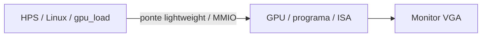

# HPS minimo para a DE1-SoC

O HPS e o processador ARM que ja existe no chip da DE1-SoC. Neste projeto
ele carrega o programa da GPU, inicia a execucao e consulta estado/erros.
Background, sprites, poligonos e VGA continuam no hardware da GPU. Nao ha
fio ou jumper para ligar HPS a FPGA: a ponte lightweight fica dentro do chip.

O modo de busca ativa permite testar a GPU **sem HPS**: o programa inicial
vem do HEX incluido no bitstream. Use primeiro esse caminho para verificar
a imagem. O HPS acrescenta a troca de programas sem recompilar o Quartus.

## Projeto preparado

A pasta [platform/hps](../platform/hps/) fornece somente clock de 50 MHz,
HPS, GPU e ligacoes de placa. Nao inclui Nios, DMA ou um jogo no ARM.
DDR3, portas HPS e constraints foram adaptados da referencia DE1-SoC da
[FPGAacademy](https://github.com/fpgacademy/Design_Examples/tree/13010c09f4863447994f0435fef80e162a40d24b/Computer_Systems/DE1-SoC).
O [manifesto](../platform/hps/reference.json) identifica fontes e hashes;
a licenca MIT foi preservada.



Gere uma copia independente a partir da raiz do repositorio:

```bash
python3 scripts/prepare_hps.py
```

O comando imprime o diretorio do projeto. Entre nele e use um terminal com
`qsys-script` no PATH, da instalacao Quartus com suporte Cyclone V:

```bash
qsys-script --search-path='platform/,$' --script=hps/create_system.tcl
```

`$` no search-path representa o catalogo padrao da ferramenta; mantenha-o
literal, dentro das aspas. O comando cria `pbl2_hps_system.qsys`. Se nao
encontrar `pbl2_gpu`, confira o caminho `platform/` e execute a partir da
copia preparada. No Windows, use o terminal do Quartus/SoC EDS ou o caminho
completo para o executavel; as aspas precisam preservar o `$` literal.

1. Abra `pbl2_hps.qpf` no Quartus. Abra o `.qsys` no Platform Designer.
2. Confira os tres componentes: `clk_0`, `ARM_A9_HPS` e `gpu`. A GPU tem
   256 palavras, programa `background_motion.hex`, clock de 50 MHz e offset
   **0x00000000** no master `ARM_A9_HPS.h2f_lw_axi_master`.
3. Use **Generate HDL**, linguagem Verilog, no diretorio
   `pbl2_hps_system`. O projeto ja aponta para
   `pbl2_hps_system/synthesis/pbl2_hps_system.qip`.
4. Compile o projeto inteiro. No TimeQuest, confira setup/hold, clocks
   de 50/25 MHz, clocks/constraints HPS DDR e caminhos nao restringidos.
   O delay externo VGA zero em `gpu.sdc` continua provisório.
5. Programe o **novo** `output_files/pbl2_hps.sof` pelo Programmer.

O HPS precisa inicializar/calibrar sua DDR3 durante o boot. Se voce ainda
nao tem Linux, prepare um microSD com uma imagem **para DE1-SoC**, conforme
o [material Linux da FPGAacademy](https://github.com/fpgacademy/Tutorials/tree/aa1e20cb031ffa92692247281d9fa8d9da9ac28b/Linux/Linux_with_ARM_A9)
ou o pacote da Terasic para sua placa. Gravar a imagem substitui o conteudo
do cartao escolhido. Use a serial USB-UART do HPS (115200, 8N1) para conferir
o boot. Nao use imagem de DE0-Nano-SoC ou de outro kit Cyclone V.

Este projeto preserva a configuracao DDR/HPS da referencia DE1-SoC, mas
um bootloader existente precisa ser compativel com ela. O Platform Designer
gera o handoff HPS; se o Linux/preloader nao inicializar a DDR, use esse
handoff no fluxo de boot DE1-SoC da referencia. O `.sof` sozinho nao instala
Linux nem configura o preloader no cartao.

## Primeiro teste de comunicacao

No Linux, depois de configurar a FPGA, habilite a ponte lightweight pelo
mecanismo fornecido pela imagem. Quando houver a interface sysfs classica:

```bash
ls /sys/class/fpga_bridge
# Substitua NOME_DA_PONTE pela entrada cujo name e a ponte lightweight:
cat /sys/class/fpga_bridge/NOME_DA_PONTE/name
cat /sys/class/fpga_bridge/NOME_DA_PONTE/enable
echo 1 | sudo tee /sys/class/fpga_bridge/NOME_DA_PONTE/enable
```

Se a imagem nao oferece `enable`, siga seu fluxo de FPGA manager/bootloader.
O carregador da GPU nao habilita clocks ou reset da ponte.

Nesta configuracao, a GPU esta no offset zero da janela lightweight
`0xFF200000`, documentada no
[header da referencia](https://github.com/fpgacademy/Tutorials/blob/aa1e20cb031ffa92692247281d9fa8d9da9ac28b/Linux/Linux_with_ARM_A9/design_files/DE1-SoC/tutorial_files/address_map_arm.h).
Confira esse offset no **.sopcinfo gerado para o bitstream que voce programou**.
Se mudar o mapa, atualize a base do comando abaixo.

Compile [software/gpu_load.c](../software/gpu_load.c) no Linux da placa,
caso tenha `cc`, ou use o compilador ARM compativel com sua imagem:

```bash
cc -std=c11 -O2 -Wall -Wextra -Werror gpu_load.c -o gpu_load
sudo ./gpu_load --base 0xFF200000 --program program_a.hex
sudo ./gpu_load --base 0xFF200000 --program program_b.hex
sudo ./gpu_load --base 0xFF200000 --program background_motion.hex --no-wait
```

Transfira o fonte/binario e os HEX para a placa primeiro; exemplos de
cross-compilacao e SCP estao em [hps-mmio.md](hps-mmio.md).
O carregador confere ID, capacidade e **cada palavra por readback** antes
de iniciar. A/B terminam em HALT; `background_motion` continua executando.

No programa continuo, LEDR3 deve ficar apagado (sem HALT), LEDR4 apagado
(sem erro), LEDR5 aceso (buffers inicializados) e LEDR9 aceso (reset liberado).
O background avanca um pixel logico por quadro; o triangulo e as sprites
permanecem fixos.

## O que foi verificado

Preparacao da copia, assets, parametros/ligacoes Tcl, pinos e elaboracao
do top com substituto da interface gerada sao verificaveis na nuvem.
A GPU e o slave Avalon possuem testes funcionais separados.
**A geracao nativa Qsys, compilacao Quartus/TimeQuest, boot Linux e MMIO na
placa ainda precisam ser executados localmente.** O ambiente nao tem Quartus
nem acesso a DE1-SoC; nenhum `.sof` integrado ou timing aprovado foi produzido.
