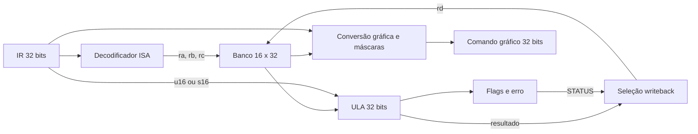
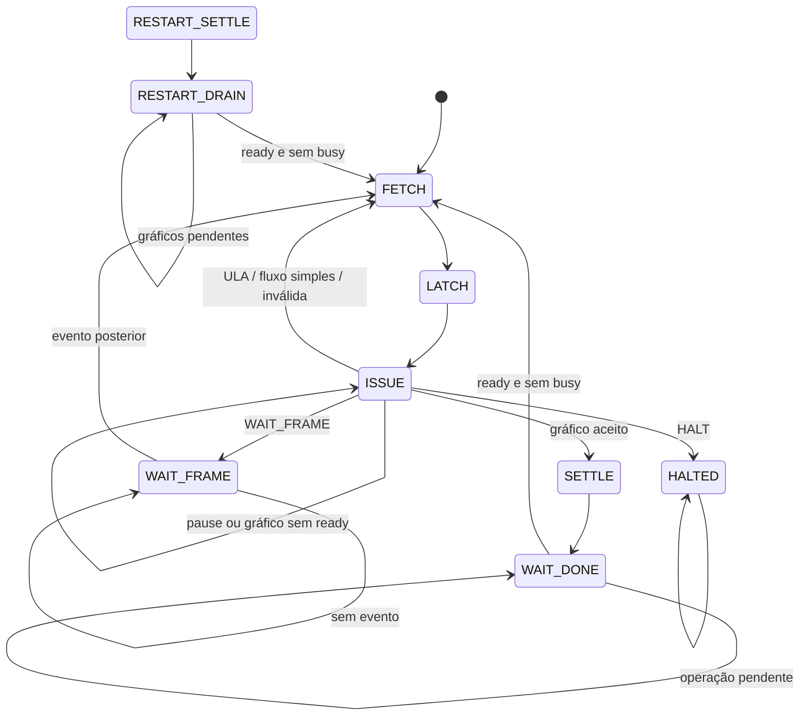

# Arquitetura implementada no PBL2

## Base preservada e módulos

O desenvolvimento parte da branch `pbl2/etapa3-conclusao-pbl1`. Motores gráficos e VGA permanecem unidades funcionais; a CPU programa essas unidades reutilizando o decoder de comandos. Isso evita duplicar a validação gráfica e conserva as codificações gráficas válidas do PBL1.

| Módulo | Responsabilidade |
|---|---|
| gpu_de1_soc_top | Wrapper com pinos CLOCK_50/KEY/SW/LEDR/VGA e MMIO inativo; parâmetros selecionam programa/modo. |
| gpu_core | Integra CPU, MMIO, gráficos, eventos de quadro e vídeo. |
| instruction_memory | ROM síncrona de 32 bits, carregada com $readmemh de PROGRAM_FILE. |
| active_fetch_controller | PC/IR, FSM, handshake, branches, WAIT_FRAME, pause/restart e estado de execução. |
| gpu_instruction_decoder | Identificação de ULA/gráficos/fluxo/HALT e validação dos reservados novos. |
| gpu_register_file | 16×32 bits, três leituras combinacionais e uma escrita síncrona; r0=0. |
| gpu_alu | Aritmética/lógica inteira, shifts, comparação e flags {V,C,N,Z}. |
| gpu_datapath | Operand mux, writeback e flags; conversão dos comandos por registrador. |
| gpu_mmio | CONTROL, STATUS, PC, IR, FRAME_COUNT e ID no domínio CLOCK_50. |
| cmd_decoder | Validação/aceitação de comandos e pulsos/campos das unidades gráficas. |
| bg_engine / tilemap_ram / pattern_vram | Background 40×30, padrões 8×8 e scroll circular. |
| sprite_engine | 32 sprites 16×16, caches, carga sequencial, flips, prioridades/transparência. |
| polygon_rasterizer / raster_alu | Varredura e funções de aresta inteiras; retângulos são dois triângulos. |
| polygon_buffer | Inicialização, buffers frente/trás e troca sincronizada. |
| vga_sync / compositor / color_palette | Temporização contínua, escolha do pixel e índice→RGB. |
| board_input_controller | Demonstração histórica, somente com USE_ACTIVE_FETCH=0. |

raster_alu é especializada no rasterizador; gpu_alu é a ULA geral. Resultados dessa ULA alimentam posição, cor, tiles, scroll e atributos pelo gpu_datapath; o banco não é uma unidade isolada de demonstração.

## Datapath e estado arquitetural

IR alimenta gpu_instruction_decoder. Índices selecionam três fontes do banco. MOVI usa extensão com zeros, ADDI usa extensão de sinal e operações R usam o banco. A saída escreve rd na borda de execução, exceto CMP; flags são registradas nessa mesma borda. STATUS seleciona erro/flags atuais para writeback, preservando flags.

Para gráficos por registrador, um mux combina os bits baixos das fontes com o opcode imediato legado. O cmd_decoder recebe essa palavra com a mesma validação e execução dos gráficos imediatos. EMIT usa a fonte inteira. Gráficos não escrevem banco.

Reset/restart zera banco/flags. Gráficos e fluxo preservam flags. Regras de carry/overflow/reservados estão na [ISA](pbl2-isa.md). A CPU não possui memória geral, stack, calls ou interrupções.

## Unidade de controle e execução

| Estado | Operação e condição de saída |
|---|---|
| FETCH | Apresenta PC à ROM síncrona; avança para LATCH. |
| LATCH | Captura leitura anterior em IR; avança para ISSUE. |
| ISSUE | Aguarda pause=0; executa ULA/fluxo/HALT/erro ou mantém gráfico válido até ready. |
| SETTLE | Permite propagação dos pulsos registrados para motores gráficos. |
| WAIT_DONE | Espera cmd_ready=1 e execution_busy=0; conclui, incrementa PC e retorna a FETCH. |
| WAIT_FRAME | Espera evento de quadro; conclui, incrementa PC e retorna a FETCH. |
| HALTED | CPU parada até reset/restart. |
| RESTART_SETTLE | Após restart, permite propagar pulsos gráficos já aceitos. |
| RESTART_DRAIN | Aguarda gráficos disponíveis/ociosos antes de buscar em PC=0. |

ULA/fluxo simples conclui em ISSUE. PC recebe PC+1 ou o endereço absoluto de branch. HALT conclui sem incrementar PC. Inválida da ISA nova conclui com erro sem escrever banco/flags/gráficos. Comando gráfico inválido passa pelo decoder gráfico, que gera cmd_error; a CPU captura erro e conclui pela sequência gráfica normal.

Restart pode levar qualquer estado a RESTART_SETTLE; reset pode levar qualquer estado a FETCH. Essas transições globais foram omitidas do desenho para facilitar a leitura.

### valid, ready, busy e done

- cmd_valid indica gráfico em ISSUE. Palavra estável até a borda cmd_valid&&cmd_ready; nenhuma aceitação ocorre durante pausa/restart/reset.
- cmd_ready fica baixo durante operações e enquanto pulsos registrados ainda precisam ser consumidos. Evita aceitar outro comando antes de busy subir.
- execution_busy é OR dos busy de rasterizador, sprite engine e polygon_buffer. Inclui carga de imagem, limpeza e apresentação pendente.
- busy da CPU indica execução/espera iniciada. Pausa antes da emissão permite busy baixo; uma espera de quadro/gráfico já iniciada permanece busy até concluir.
- done é pulso de um ciclo por instrução concluída, incluindo inválida e HALT. halted é a indicação persistente de programa encerrado.
- error é persistente para ISA/comando inválido; reset/restart/clear_error limpa. Novo erro no ciclo de clear_error tem prioridade.

SETTLE existe porque o decoder registra start e o motor só observa esse pulso na borda seguinte. Consultar busy imediatamente após a aceitação permitiria emissão prematura. WAIT_DONE consulta ready e busy antes de concluir.

### Pause e restart

Pause impede efeitos e aceitação em ISSUE. Uma instrução pode terminar a busca e ficar retida em ISSUE sem ser pulada. Uma operação já aceita continua até concluir; WAIT_FRAME também pode concluir durante pausa. Na retomada, cada instrução é emitida uma vez.

Restart reinicia PC/IR/banco/flags/erro sem resetar VGA, paleta, tilemap, sprites ou buffers. Uma operação aceita termina antes de novas instruções. O programa reiniciado deve configurar/limpar o estado gráfico necessário: restart não restaura a cena inicial. FRAME_COUNT permanece, pois pertence ao MMIO. Reset pela placa reinicializa CPU, controles, sprites, buffers e temporização; CLUT e tilemap preservam escritas anteriores, como no PBL1.

## Gráficos, quadros e VGA contínuo

VGA usa CLOCK_50=50 MHz e pixel clock nominal 25 MHz, independentemente da FSM. São 800 períodos/linha×525 linhas/quadro, aproximadamente 59,52 Hz. Cada pixel lógico 320×240 ocupa 2×2 na saída 640×480. Coordenadas, sincronismo, validade e pixel são alinhados pelo pipeline existente.

frame_boundary é um pulso na entrada no intervalo vertical, observado em CLOCK_50. WAIT_FRAME espera um evento **posterior** à entrada na espera; o evento na borda de emissão não satisfaz a instrução. A CPU não controla o clock VGA.

Os buffers de polígonos são limpos sequencialmente no reset. RGB fica mascarado até terminar a inicialização, preservando sincronismo e evitando pixels indefinidos. Com buffer duplo, desenhos/limpeza atingem o buffer de trás. PRESENT solicita troca no evento vertical e conclui após apresentação; CPU fica esperando.

Buffer duplo cobre somente polígonos; mapa/paleta/sprites atualizam diretamente. WAIT_FRAME alinha emissão ao quadro, sem criar atualização atômica de todas as camadas.

Cada sprite possui cache de 256 pixels; uma ROM compartilhada carrega o cache sequencialmente, com busy até o último pixel. Cache inválido não é exibido. Quatro tiles 8×8 formam a imagem 16×16; flips atingem a imagem completa, inclusive quadrantes. Prioridade maior vence entre opacos; empate usa menor ID. Transparência é aplicada antes da escolha. Composição entre camadas é sprite→polígono→background. Com banco habilitado, nibble inferior zero permanece transparente.

Rasterização usa funções de aresta inteiras, aceita orientações opostas, inclui bordas, descarta área zero e limita escrita à área lógica. TRI1/TRI2 guardam vértices; TRI3 captura primitiva/cor e dispara. RECT/RECTR usam duas primitivas; precisam de área positiva para pixels. Não há um segundo motor de retângulos.

## Inicialização de memórias e reset

| Estado/memória | Estratégia |
|---|---|
| PC, IR, banco de registradores, flags, status e controle | Reset; restart MMIO afeta somente o estado da CPU. |
| ROM de instruções e ROMs de padrões | HEX carregado na elaboração/configuração; nenhuma escrita por MMIO. Os programas novos preenchem todas as 256 palavras com instruções ou HALT. |
| Tilemap e CLUT | Inicialização por HEX; escritas feitas pelo programa permanecem após reset comum ou restart da CPU. Reprogramar a FPGA restaura os arquivos iniciais. |
| SAT e estilo dos sprites | Reset de atributos; sprite 0 conserva o padrão histórico, que os dois programas novos desabilitam pela ISA. |
| Caches de sprites | RAM sem reset por célula; cache_valid oculta conteúdo até a carga de 256 pixels terminar. |
| Buffers de polígonos | Limpeza sequencial dos dois bancos no reset; 76.800 ciclos em paralelo, aproximadamente 1,536 ms a 50 MHz. |
| Registros brutos de leitura e pipeline de vídeo | Leituras RAM podem iniciar indefinidas; validade e máscara de RGB impedem propagação aos pinos antes da inicialização. |

Reset não recarrega HEX durante a execução. Um programa deve configurar o estado
gráfico de que precisa, incluindo desabilitar sprites anteriores no restart se
necessário. Reinício da CPU preserva tanto o vídeo quanto as alterações gráficas.

## MMIO e status

gpu_core expõe endereço de byte de 6 bits, read/write, dados de 32 bits, byteenable e waitrequest. Leituras são combinacionais e waitrequest é zero. gpu_mmio fornece pause/restart/clear_error e estado, PC, IR, contador de quadros e identificação PBL2.

STATUS MMIO: ready[0], busy[1], halted[2], erro[3], buffers inicializados[4], buffer frontal[5], buffer duplo[6], sprite busy[7], waiting_frame[8], pulso done[9], flags Z/N/C/V[13:10]; [31:14]=0. A instrução STATUS da ISA lê somente flags/erro.

MMIO está ligado à CPU na integração RTL. O top fornecido não instancia HPS/ponte e mantém o barramento inativo. Será necessário gerar/conectar Platform Designer, atribuir mapa de endereços e tratar clock/reset/CDC. Não há endereço físico de software definido nem driver Linux. Consulte [hps-mmio.md](hps-mmio.md) para o contrato e a integração restante.

## Programa, Quartus e modo histórico

Top principal usa busca ativa e programs/background_sprites.hex com 256 palavras. programs/polygons_motion.hex tem a mesma capacidade: a seleção muda somente PROGRAM_FILE. A ROM é carregada na elaboração/síntese; MMIO não substitui o programa durante execução.

QSF inclui RTL/imagens. synth_quartus.sh --program programs/arquivo.hex --words N prepara/compila uma cópia isolada e aplica parâmetros nela. --prepare-only não requer Quartus e não gera bitstream. --board preserva botões; --active/--pbl1 selecionam os HEX históricos. A [README](../README.md) traz comandos completos.

## Desempenho, verificação e limites

ULA/fluxo simples usa três ciclos (FETCH, LATCH, ISSUE). Gráficos acrescentam SETTLE/WAIT_DONE e duração da unidade. A CPU serializa instruções, inclusive operações em unidades diferentes, para conclusão determinística com arquitetura simples.

Custos principais são limpeza de framebuffers, varredura do rasterizador e carga sequencial de caches de sprites. WAIT_FRAME/PRESENT podem esperar quase um quadro. VGA continua durante as esperas. Capacidade de programa é 256 palavras; RECT/RECTR ocupa seis por expansão.

test_pbl2.sh valida banco/ULA/decoder/datapath, controle, MMIO, dois programas e integração; reaplica 17 testes gráficos. Icarus verifica inicialização em quatro estados. Testes Python validam montador, e HEX publicados são comparados com a montagem. Nenhum teste requer HPS real.

**Validação integrada concluída em software:** 12 testes Python e 22 testbenches RTL distintos passaram; ambas as demos tiveram os comandos, o estado final e um quadro VGA após HALT verificados. Pré-síntese Cyclone V passou em busca ativa e modo histórico. O [relatório de validação](pbl2-validation.md) registra resultados e contagens preliminares. Yosys verifica hierarquia/drivers/inferência de RAM sem determinar ALMs finais, Fmax ou timing da placa. Relatórios finais precisam ser produzidos no Quartus/TimeQuest. Demonstração física, revisão PCB, restrições externas VGA e ponte HPS não foram verificados na nuvem.

Próximos trabalhos dependem da validação física: revisar gargalos do fitter, integrar HPS e completar software posterior. Esta etapa não implementa jogo novo, teclado/mouse, driver Linux, DMA ou carregamento de programa pela CPU ARM.
