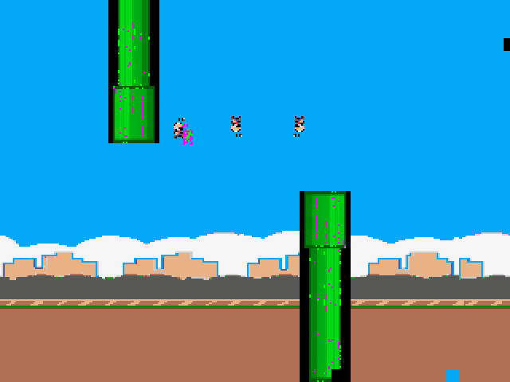
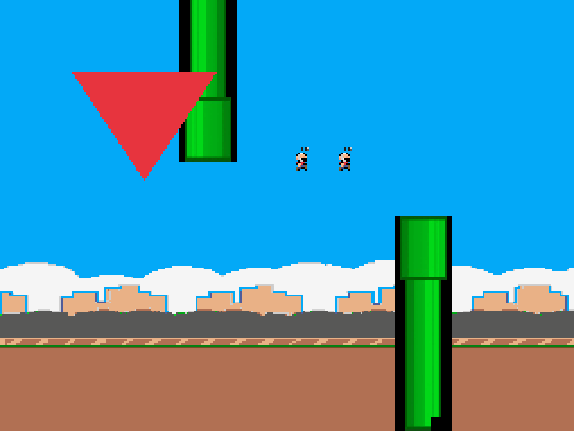
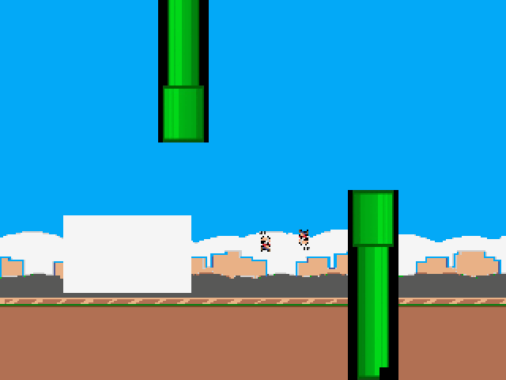

# Investigação da renderização e troca de programas

## Evidência disponível

A fotografia foi apresentada como exemplo de execução, sem identificação do
HEX carregado e sem relatório TimeQuest. Ela não especifica uma cena que o
coprocessador deva reproduzir. Não foi possível medir pixels, sinais ou timing
da placa a partir dela. As conclusões abaixo vêm do RTL, dos recursos HEX e de
testes independentes; nenhum motor foi reescrito para aproximar sua aparência
da fotografia.

O enunciado PBL2 permite busca ativa com programa interno e exige uma ISA
definida pela equipe. O anexo desta rodada acrescenta a troca pelo HPS sem
recompilação e dois programas com polígono e sprites. Não há formato de opcode
fixado pelo enunciado que obrigue a substituir a ISA já documentada.

## Conteúdo dos programas e recursos gráficos

Esta é uma **referência calculada dos arquivos HEX**, sem captura da placa:



A posição relativa dos canos, as figuras pequenas sobrepostas e os pontos
magenta/verde são compatíveis com o exemplo fotografado. Isso sugere execução
do programa inicial, mas não identifica com certeza o bitstream utilizado.

- `background_sprites.asm` executa CLEAR e nunca TRI1/TRI2/TRI3. A ausência
  de polígonos nessa cena é consequência das instruções, não demonstra falha
  do rasterizador. `polygons_motion.asm` e os novos A/B desenham polígonos.
- A CLUT é **global para background, polígonos e sprites**. O programa inicial
  grava os índices 49–63 em magenta/verde para demonstrar o banco de sprites;
  esses índices também aparecem em 216 pixels lógicos do background inicial.
  Recolorir um índice afeta todos os elementos que o utilizam. Isso explica
  os pontos nos canos sem alterar coordenadas ou mascarar um erro do motor.
- A imagem de sprite formada pelos tiles 1–4 contém 58 pixels opacos em
  16×16, incluindo pontos isolados. A imagem fornecida é uma pequena figura;
  o nome histórico “bird” não determina o conteúdo do arquivo. Com banco
  habilitado, nibble baixo zero é transparente, conforme a ISA.
- As sprites 1/2 do programa inicial ficam em X=104/110: há sobreposição
  deliberada e uma delas usa banco 3. As sprites 3/31 ficam em X=140/180.
  São quatro sprites, ainda que duas pareçam uma figura composta.
- O bloco ciano junto ao limite inferior também está no modelo: o comando
  TILE 39,29,5 escreve a última célula do tilemap para testar seus limites.
  Ele pertence ao background, não a um polígono parcialmente rasterizado.

Os programas antigos e os arquivos de imagem/paleta foram preservados. A/B
usam a paleta inicial sem gravar CLUT, inicializam as posições/estilos que
utilizam e desabilitam os 32 IDs antes de desenhar. Isso torna os novos exemplos
reexecutáveis depois de outro programa, sem fixar cenas na unidade de controle.
Um programa que precise de cores independentes deve reservar índices/bancos
e gerenciar essa CLUT compartilhada; o hardware não fornece paletas separadas
por camada.

## Rasterizador, sprites e sincronização

`tb_polygon_random.sv` compara cada escrita com uma máscara de tela calculada
por aritmética inteira independente. Icarus e Verilator passaram com os mesmos
100 triângulos, 652.433 escritas e 4.352 verificações da ULA: permutações de
vértices, limites, área zero, recorte fora da tela e mudança de entradas após
aceitação durante busy. Endereços, duplicações e última escrita são conferidos.
Não foi reproduzido erro de orientação, overflow no domínio usado pela GPU ou
desenho fora do framebuffer.

A auditoria adicional de sprites em Icarus passou 720 combinações e 57.600
pixels, usando o arquivo de padrões e um modelo de quadrantes/divisão distinto
do cache RTL. Incluiu quatro flips, transparência/bancos e limites X319–511,
Y239–255. A regressão versionada também cobre 32 IDs, prioridade, sobreposição,
flips e comandos. Não houve corrupção funcional reproduzida nos caches.

Na integração, background tem duas etapas de RAM; sprites/polígonos são
alinhados à mesma latência e a CLUT acrescenta uma etapa. Os quadros VGA são
comparados pixel a pixel depois de HALT. O endereço geométrico de depuração
`sp_vram_addr` não fornece a cor dos sprites: o compositor recebe os caches
independentes por `sp_pixel`.

## Falhas funcionais corrigidas

1. A memória de instruções era somente leitura; trocar o programa requeria
   outra configuração FPGA. Agora MMIO escreve a RAM, confirma dados por
   readback e define o comprimento. Carga só é permitida com CPU pausada e
   motores drenados; sair da carga reinicia PC/IR/banco/flags.
2. Um programa de 256 palavras sem HALT podia voltar implicitamente ao PC0.
   O núcleo agora conclui a última operação e injeta HALT; desvios explícitos
   continuam válidos. Programas curtos têm limite próprio e não executam
   instruções restantes de uma carga anterior.
3. HALT anterior podia continuar visível durante o pulso pendente de restart.
   O status agora invalida HALT e indica busy imediatamente, evitando que o
   cliente interprete o programa novo como concluído antes de começar.
4. Durante os dois clocks de liberação do reset interno, uma transação Avalon
   podia parecer aceita e ser descartada. O barramento agora mantém waitrequest
   ativo até a liberação real; o teste do wrapper verifica escrita/leitura
   pendente, inclusive reset por KEY, com aceitação exatamente uma vez.

RAM, comprimento e modo de carga permanecem após reset da GPU. Preservar modo
de carga impede que um reset durante upload execute instruções parcialmente
gravadas. Reconfigurar a FPGA restaura o HEX inicial.

O teste `tb_pbl2_upload` usa uma única instância do núcleo e envia os programas
por MMIO, sem substituir memórias ou temporização por acesso hierárquico.
O procedimento e o cliente C estão em [hps-mmio.md](hps-mmio.md).

Estes quadros foram capturados **da simulação do VGA real do núcleo**, após
carga A→B no mesmo hardware. Um contador VGA independente confere RGB,
sincronismo e blank; cada quadro completo cobre 840.000 ciclos de CLOCK_50.





Para reproduzir a captura, após a suíte de testes:

```bash
.build/pbl2/tb_pbl2_upload/Vtb_pbl2_upload +dump_vga
# Saída: .build/pbl2/program_a_vga.ppm e program_b_vga.ppm (640×480).
```

## Limites físicos e próximos testes na placa

Nenhum teste de RTL aprova timing físico. O caminho de prioridade de 32 sprites
e as funções de aresta precisam ser analisados no fitter/TimeQuest desta
versão; relatórios e SOF históricos não servem como evidência. Conferir clocks
20/40 ns, setup/hold, slack, caminhos não restringidos e restrições do DAC VGA.

O modo simples escreve no buffer visível e pode mostrar atualizações parciais.
Uma colisão de leitura/escrita no mesmo endereço de M10K com `no_rw_check`
não possui garantia física de old-data pela simulação. Para quadros completos,
usar BUFFER_CONFIG 1, CLEAR/desenho e PRESENT. A foto estática após HALT não
prova que houve esse tipo de colisão. Os dois clocks do buffer usam CLOCK_50
no núcleo; utilizar esse módulo com clocks assíncronos exigiria CDC adicional.

As coordenadas da ISA são sem sinal: X de 9 bits, Y de 8 bits. Valores altos
de registradores são mascarados. Isso permite recorte à direita/embaixo;
posição negativa não representa recorte à esquerda/cima. Essa limitação está
documentada na ISA e não foi ampliada sem requisito do enunciado.

A ponte física HPS ainda precisa ser gerada com configuração DDR/boot/pinagem
da placa e o mapa real do Platform Designer. Os arquivos entregues incluem
componente, cliente e protocolo testado; não constituem validação da ponte
ou do Linux ARM em hardware.
